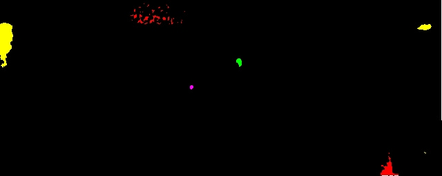

# DFFC-NET
This is Pytorch implementation for DFFC-NET: A Dual-branch Feature Fusion Classification Network for Subsurface Defect Detection in Ultrasonic Infrared Thermography Using Spatiotemporal Signals

## Overview

The overall framework for DFFC-NET
## Detect example

## Running the code
Run data_sampling.py to perform background subtraction on the original heatmap data

Run Segmentation.py to perform thresholding on the images after background subtraction to obtain threshold-segmented images, and annotate the segmented images, saving the results to path.

Run Data_process.py to obtain the MT(maximum-normalized temperature-spatial sequence) and CT(the correlation coefficient time sequence)

Run train.py to train the model

Run visualization.py to load the pre-trained model "model.pkl" to visualize defect detection

## Data

Considering that the original dataset in the paper is quite large, we provide a smaller dataset to simplify users' data processing and model training operations. 
In addition, you can upload your custom dataset to the original_data_FTS folder and perform new training and testing according to the execution flow of the code mentioned above.

## visualization
You can load our pre-trained model "model.pkl" for corresponding tests, or train new models for visual testing.

